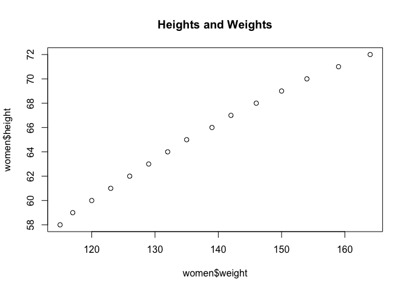
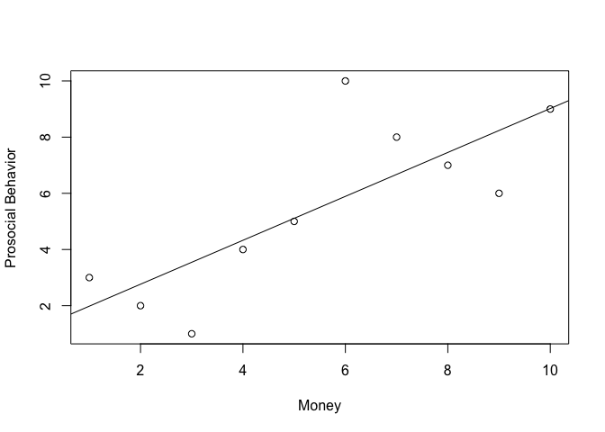
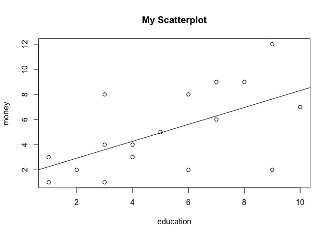

Correlation and Regression
================

#### Scatterplots

Saved in your console is a dataset called women which contains the height and weight of 15 women (try typing it into your console and press enter to have a look). Let's have a look at the relationship between height and weight through a scatterplot, using the R function plot(). The first argument of plot() is the x-axis coordinates, and the second argument is the y-axis coordinates.

-   In your script, make a scatterplot of women with weight on the x-axis, and height on the y-axis.
-   Use main = *title here* inside plot() to add the title "Heights and Weights"

``` r
plot(women$weight,women$height,main="Heights and Weights")
```



#### Making a Contingency Table

Saved in your console is a dataset called smoking, which contains data about amount of tobacco smoked per day in a sample of 88 students. The student variable says whether a student is in high school, or university, and the tobacco variable indicates how many grams of tobacco are smoked per day. We expected that there would be more tobacco use (the dependent variable) in university (the independent variable).

We can make a contingency table of this data using the table() function. While previously you may have used this with one variable, this time you will use it with two. The first variable used with table() will appear in the rows, while the second variable will appear in the columns.

-   Make a contingency table with amount of tobacco smoked as rows, and education as columns.

``` r
#table(smoking$tobacco,smoking$student)
```

#### Calculating Percentage From Your Contingency Table

Have a look at the contingency table of tobacco consumption and education you made in the last exercise. It's saved in your console as st. Let's use it to calculate some percentages!

In this exercise you need to report your answers to one decimal place. You are free to do this manually, but if you want a quick way to do this through R you can use the round() function. The first argument of round() is the value that you want to round (this can be in the form of a raw number, or an equation), and the second argument is digits =, where you specify the number of decimal places you want the number rounded to. For instance, round(12.6734, digits = 2) would return the value 12.67.

-   What percentage of high school students smoke 0-9g of tobacco?
-   Of the students who smoke the most, what percentage are in university?

``` r
round((17/44)*100,2)
```

    ## [1] 38.64

``` r
round((15/26)*100,2)
```

    ## [1] 57.69

#### Interpreting Your Scatterplot

This is the graph you created of heighs and weights. Based on your graph, what can you say about the relationship between height and weight? 

##### Possible Answers

-   \[x\] It is linear and positive
-   \[ \] It is linear and negative
-   \[ \] It is curvilinear and positive
-   \[ \] It is curvilinear and negative

#### Pearson's R I

Pearson's r is a measure of how strongly the variables are correlated with each other. Look at the graph on the right. Which of the following Pearson's r values are likely to belong to this graph? 

##### Possible Answers

-   \[ \] -0.26
-   \[ \] 0.418
-   \[x\] 1.0
-   \[ \] -0.77

#### Pearson's R II

Which of the following Pearson's r values are likely to belong to this graph? 

##### Possible Answers

-   \[ \] -0.26
-   \[x\] 0.418
-   \[ \] 1.0
-   \[ \] -0.77

#### Pearson's R III

Which of the following Pearson's r values are likely to belong to this graph? 

##### Possible Answers

-   \[ \] -0.26
-   \[ \] 0.418
-   \[ \] 1.0
-   \[x\] -0.77

#### Pearson's R IV

Which of the following Pearson's r values are likely to belong to this graph? 

##### Possible Answers

-   \[x\] -0.26
-   \[ \] 0.418
-   \[ \] 1.0
-   \[ \] -0.77

#### Calculating Correlation Using R

We can calculate the correlation in R using the function cor(), which takes your two variables as it's first argument. Try it out on the variables shown in the graph.

-   Calculate the correlation between var1 and var2

``` r
#cor(var1,var2)
```

#### Finding The Line

When we draw a line through our data, we measure error as the sum of the difference between the observation and the line. We usually square this so that positive and negative residuals don't cancel each other out. The line that gives us the least error is our regression line.

To do this you should use the sum() function, which returns the sum of all vectors provided between brackets. You can also put ^2 inside the brackets with your vectors in order to square the differences. For example, sum((vector1 - vector2) ^ 2).

-   y1 contains the predicted values of y according to line 1, y2 contains the predictes value of y according to line 2, and y contains the actual observed values of variable y.
-   In your script, calculate the squared error of line 1 and line 2.
-   Take a look at the output!

``` r
# predicted values of y according to line 1
y1 <- c(1, 2, 3, 4, 5, 6, 7, 8, 9, 10)

# predicted values of y according to line 2
y2 <- c(2, 3, 4, 5, 6, 7, 8, 9, 10, 11)

# actual values of y
y <- c(3, 2, 1, 4, 5, 10, 8, 7, 6, 9) 

# calculate the squared error of line 1
sum((y1 - y) ^ 2)
```

    ## [1] 36

``` r
# calculate the squared error of line 2
sum((y2 - y) ^ 2)
```

    ## [1] 46

#### Interpreting The Line

 This graph shows how prosocial someone is after you give them money. Use the graph to answer the following questions. You can round your answer up to the nearest whole number

-   How prosocial would we predict someone to be when they recieve 6 units of money?
-   How prosical was the person who recieved 6 units of money in our study?

``` r
# How prosocial would we predict someone to be when they recieve 6 units of money?
6
```

    ## [1] 6

``` r
# How prosical was the person who recieved 6 units of money in our study?
10
```

    ## [1] 10

#### The Regression Equation

The regression equation is Y = a + bx, where a is the intercept and b is the slope of the line. Imagine we are investigating how extraversion affects risk taking. According to the regression formula, someone with an extraversion level of 0 will have a risk taking level of 3, and with every single unit increase in extraversion, risk taking increases by 3.3.

-   Use the information you have to establish the values of a and b.
-   In your console, use your regression equation to calculate the expected level of risk taking of someone with an extraversion level of 7.

``` r
b=3
a=3.3
# What is the risk taking level of a person with an extraversion level of 7?
y <- 7*a+b
y
```

    ## [1] 26.1

#### Describing The Line

The equation for the blue line in the graph is Y = 1 + 0.7818(X). What is the equation for the red line? 

##### Possible Answers

-   \[ \] Y = 1 + 3.7818(x)
-   \[x\] Y = 4 + 0.7818(x)
-   \[ \] Y = 4 + 3.7818(x)
-   \[ \] Y = 1 + 0.7818(x)

#### Finding The Regression Coefficients in R

We can find the regression coefficients for our data using the lm() function, which takes our model as the first argument: first the y variable, followed by a ~ symbol, then the x variable. For instance: lm(y ~ x). The output labels the value of the intercept with 'intercept', and the value of the slope with the name of the independent variable. Let's try this out with our study that investigated how money (independent variable) predicted prosocial behavior (dependent variable).

``` r
# Our data
money <- c(1,2,3,4,5,6,7,8,9,10)
prosocial <- c(3, 2, 1, 4, 5, 10, 8, 7, 6,9)
# Find the regression coefficients
lm(prosocial~money)
```

    ## 
    ## Call:
    ## lm(formula = prosocial ~ money)
    ## 
    ## Coefficients:
    ## (Intercept)        money  
    ##      1.2000       0.7818

#### Using lm() To Add A Regression Line To Your Plot

In the last exercise you used lm() to obtain the coefficients for your model's regression equation, in the format lm(y ~ x). takes the y variabWe can store this output and use it to add the regression line to your scatterplots! After you have created your scatterplot, you can add a line using the function abline(). abline() takes the intercept of the line as its first argument, and the slope of the line as its second argument. This makes it a pretty good candidate for storing your lm() output as an object, and putting it straight into abline. Let's try this out!

``` r
# Your plot
plot(money, prosocial, xlab = "Money", ylab = "Prosocial Behavior")
# Store your regression coefficients in a variable called "line"
line <- lm(prosocial~money)
# Use "line" to tell abline() to make a line on your graph
abline(line)
```



#### Adding A Line

We can use abline() to add any line we like, as long as the first argument is the intercept and the second is the slope. Let's try it out! money and prosocial are still saved in your console.

-   Add a line of code to show the mean value of the dependent variable

``` r
# Your plot
plot(money, prosocial, xlab = "Money", ylab = "Prosocial Behavior")
# Your regression line
line <- lm(prosocial ~ money)
abline(line)
# Add a line that shows the mean of the dependent variable
abline(a=mean(money),b=0)
```


#### R Squared I

These are the two lines you plotted in the last assignment. One line shows the mean, and one shows the regression line. Clearly, there is less error when we use the regression line compared to the mean line. This reduction in error from using the regression line compared to the mean line tells us how well the independent variable (money) predicts the dependent variable (prosocial behaviour).

Conveniently, the R squared is equivalent to squaring the Pearson R correlation coefficient. We're going to calculate the R squared for prosocial and money.

``` r
# Calculate the R squared of prosocial and money
cor(prosocial,money)
```

    ## [1] 0.7818182

#### R Squared II

In addition to being the reduction in residual error from using the regression line over the mean line, and, of course the pearson correlation coefficient squared, how else can we describe the R squared?

    The variation in the dependent variable explained by the independent variable

#### Correlation and Causation

You measured how much money people have and their education level in a town. The graph on the right shows the results. We cannot say that more educaion causes more money, we say it is related to more money. Which of the following is not a reason why education is only related to money?


    # Possible Answers
    - [x] There could be a third unmeasured variable that influences only money
    - [x] There could be a third unmeasured variable that influences only education
    - [ ] There could be a third unmeasured variable that influences both education and money
    - [ ] Money and education could influence each other

#### Putting It Together: Regression

Let's try to put it all together. You've conducted a study looking at how much money people have (dependent variable) and their education level (independent variable). Let's check some different things in your data!

``` r
# your data
money <- c(4, 3, 2, 2, 8, 1, 1, 2, 3, 4, 5, 6, 7, 9, 9, 8, 12)
education <- c(3, 4, 6, 9, 3, 3, 1, 2, 1, 4, 5, 7, 10, 8, 7, 6, 9)

# calculate the correlation between X and Y
cor(money,education)
```

    ## [1] 0.5846627

``` r
# save regression coefficients as object "line"
line <- lm(money~education)

# print the regression coefficients
line
```

    ## 
    ## Call:
    ## lm(formula = money ~ education)
    ## 
    ## Coefficients:
    ## (Intercept)    education  
    ##      1.5744       0.6731

``` r
# plot Y and X
plot(education,money,main="My Scatterplot")

# add the regression line

abline(a=line,b=cor(money,education))
```



#### Putting It Together: Contingency Tables

Let's say you ran the same study looking at how much money people have and their education level, but you used categories instead. You measured education (the independent variable) as "high school" or "university" and money (the dependent variable) as "high" or "low". This information is saved in your console as td.

``` r
# Percentage of people with high money that are university educated
83.33333
```

    ## [1] 83.33333

``` r
# Percentage of people with low money that are high schol educated
72.72727
```

    ## [1] 72.72727

``` r
# What kind of education is linked to more money?
"university"
```

    ## [1] "university"
